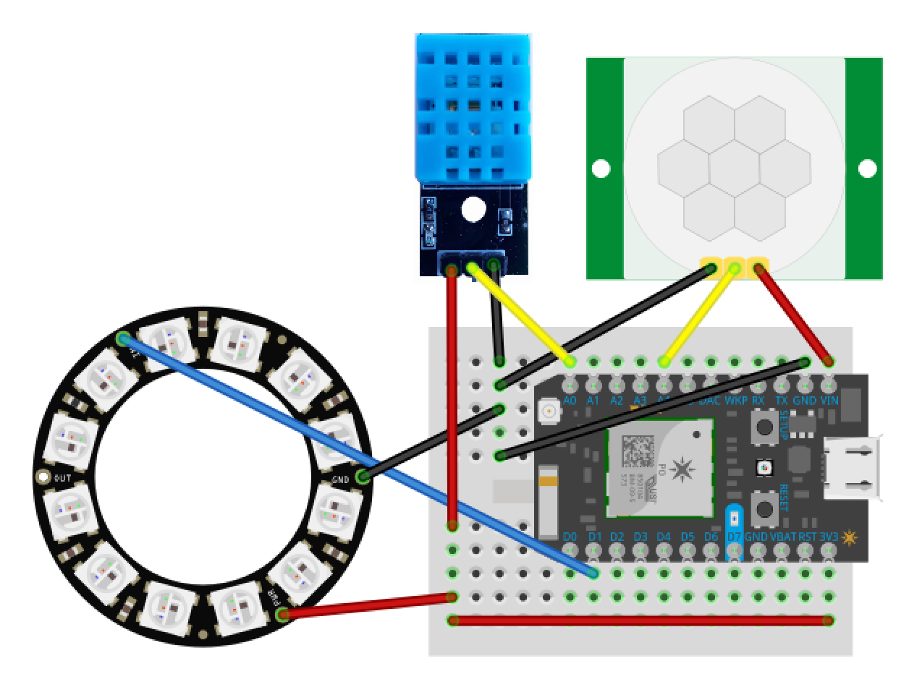

<!-- Project information -->

[](https://github.com/Nase00/gtfo/releases)


<!-- Build & code status -->

[](https://travis-ci.org/Nase00/gtfo)
[](https://coveralls.io/github/Nase00/gtfo)
[](https://www.bithound.io/github/Nase00/gtfo/master/files)

<!-- Dependency status -->

[](https://snyk.io/test/github/Nase00/gtfo)
[](https://david-dm.org/nase00/gtfo)
[](https://david-dm.org/nase00/gtfo#info=devDependencies)

# **G**ently **T**ell **F**olks **O**ut (of meeting rooms)

Push reservation notifications to meeting rooms!

Using remote modules equipped with RGB LEDs,
GTFO lets meeting room occupants know the status of their current reservation.
For example, 5 minutes before a meeting ends and another is set to begin,
the room's LED will light up orange to let occupants know it's time to begin wrapping up.

# Getting started

## Minimum requirements

#### Room notification lights

The hardware setup consists of a **host server** and _n_ number of **remote modules**.

A Unix-based system is required to run the host server which will control each remote module.
A Raspberry Pi is recommended for its small footprint and power consumption,
but a spare computer running OSX or Linux can be used just as well.

A network with 802.11b/g/n WiFi hotspots is required for the remote modules to connect to. Particle Photons are headless devices,
so note that the hotspot security must _not_ require a browser-based login portal for authenticating.
(Router passwords, however, can be entered through Particle's terminal setup application.)
MAC address white-listing can also be used for additional security.

The host server must be on the same LAN as the remote modules.

### Office map

The host server will serve a map of the office on `http://[host-ip-or-name]:3000`,
with programmatically-generate tiles for each remote module declared in `environment/devices.json`.

For this map to be usable, you must provide your own background image(s) and the size and position of each room tile.
See [environment configuration documentation](./environment/README.md).

Minimum required hardware **per each remote module**:

* [Particle Photon](https://store.particle.io/)
* NeoPixel (or equivalent WS2812 LEDs)

## Hardware Setup

[](./schematic.fzz)

#### Photon Boards

Photon boards communicate with the Particle cloud and receive updates through the [Particle API for JS](https://www.npmjs.com/package/particle-api-js).

[Connect each board](https://docs.particle.io/guide/getting-started/start/photon/) to your WiFi network.

Flash each module with `firmware/firmware.cpp`.
(`npm run flash` is a WIP script to flash every device listed in `devices.json`.)

Retrieve the access tokens and device ids for each Photon, and place them into `environment/devices.json`.
See [environment configuration documentation](./environment/README.md).

Wire a set of NeoPixels to each Photon board. Optionally, wire a motion and temperature sensor.

Note that the firmware is configured to run with 12 NeoPixels. I recommend [this](https://www.adafruit.com/product/1643) ring for the best effects, but other NeoPixel configurations can be used. Just be sure to update `PIXEL_COUNT` in firmware.cpp to the correct number of pixels.

###### LED pin configuration (required)

Hardware: NeoPixel Ring (or equivalent WS2812 LEDs)

|  Wire   |  Pin   |
| :-----: | :----: |
| Data in |   D2   |
|   PWR   |   3v   |
|   GRN   | Ground |

###### Temperature and humidity sensor pin configuration (optional, must be enabled in [environment configuration](./environment/README.md))

Hardware: [DHT11 (with breakout board)](https://smile.amazon.com/gp/product/B06XHJ1BPC)

| Wire |  Pin   |
| :--: | :----: |
| Out  |   A4   |
|  +   |   3v   |
|  -   | Ground |

###### Motion sensor pin configuration (optional, must be enabled in [environment configuration](./environment/README.md))

Motion sensors enable detecting presence of room occupants in unreserved rooms,
and setting the room status to "squatted" on the office map.
Hardware: [HC-SR501](http://www.instructables.com/id/PIR-Motion-Sensor-Tutorial/)

| Wire |  Pin   |
| :--: | :----: |
| Data |   A0   |
| VCC  |   3v   |
| GND  | Ground |

## Software Setup

```bash
git clone https://github.com/Nase00/gtfo.git && cd gtfo && npm install
```

Before the application can be run, [read how to configure it to your specific office](./environment/README.md) or run `npm run demo` to generate an example configuration. The application will not run otherwise.

```
# After environment files have been configured
npm run hot --mocks
```

This will start the application in development mode with [mock data](./server/mocks/README.md), [hot-reloading](https://github.com/gaearon/react-transform-boilerplate), and [Redux DevTools](https://github.com/gaearon/redux-devtools). At this point, the application should find and connect to each Particle Photon, and light up the LEDs.

To develop with live data, set up and run [ems-wrapper](https://github.com/rishirajsingh90/ews-wrapper) on the same local machine.
_Note that any service could be used in place of ems-wrapper, so long as the API is identical. Documentation on API contract coming soon._

In production mode, it assumed `ems-wrapper` is deployed on another domain, defined in `environment/config.json`.
See [environment configuration documentation](./environment/README.md).

##### Production build and deploy

```bash
npm install --production # Several dev dependencies are not Raspberry Pi compatible.
npm run prod # Production mode with live data. ems-wrapper or an equivalent service must be deployed and defined in environment/config.json!
```

### Ping API

_[Alexa](https://developer.amazon.com/public/solutions/alexa), where is Kerbin?_

_Kerbin is on the east side of the office. I've highlighted it on map for you._

The Ping API allows external services to "ping" specific rooms on targetted clients. Clients can be targetted using "anchors."
The anchor id used is completely arbitrary, but must be matched between the service making the ping and the client attempting to be pinged.

To anchor a client, simply add an `anchor` query paramter to its route. E.g., `http://hostname:3000/sears-tower-251?anchor=east-lobby` defines the client's anchor as `east-lobby`.

To ping this client from an external service, direct a POST request to `http://hostname:3000/api/ping` with the headers:

```js
{
  "id": "foo", // Required only when using a proxy (see blow), must match the application ID set in config.json
  "targetId": "kerbin",
  "anchor": "east-lobby",
  "event": "NEW_ROOM_PING"
}
```

The result of this ping is that Kerbin lights up on the client anchored to the east lobby. An example use of this is anchoring a client on a display in the east lobby, and assigning a nearby Amazon Echo to highlight queried rooms on the TV.

#### Ping troubleshooting

Some internal office networks restrict exposing ports for making HTTP requests. This would make it impossible, for instance, for an Echo lamdba service hosted on AWS to send a ping request to a GTFO server hosted on the office intranet. For these restricted networks, _[Acheron](https://github.com/Nase00/acheron)_ was created to be hosted externally (e.g., on a cloud service) to accept and forward pings to GTFO via a WebSocket connection.

To avoid confusion, note that there are two distinct WebSocket services within GTFO. The [socket controller]('./server/controllers/socket') exists to _host_ a WebSocket server to which browser applications connect to as _clients_. The [proxy controller]('./server/controllers/proxy') controller exists to connect to the proxy _host_ where GTFO itself is considered the sole _client_.

## Development

##### Development mode with hot-module reloading

```bash
npm run hot
```

##### DevTools keybindings

`shift+q` Open/close DevTools dock.
<br/> `shift+w` Change DevTools dock position.
<br/> `shift+e` Change active DevTools monitor.

##### Tests

```bash
npm run test # Lints and tests client, server, and universal code.
```

##### CLI Options

```bash
# pipe flags with "--", e.g. "npm run hot -- --mocks --dhc"
--mocks # Disables Outlook api in favor of using mock reservation data.
--dhc # Disables consoleController's fancy terminal output, sometimes needed for debugging.
--dd # Disables devices, useful for client testing without room module hardware.
```
